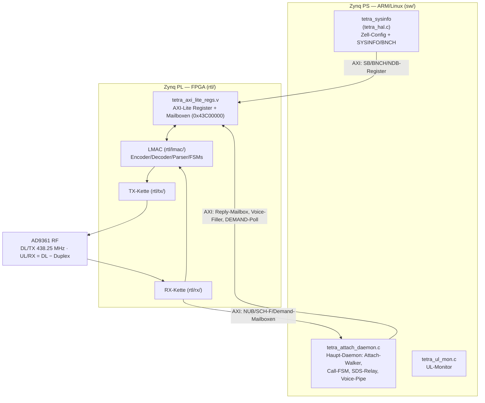
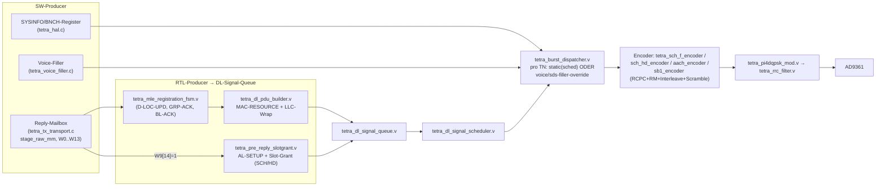
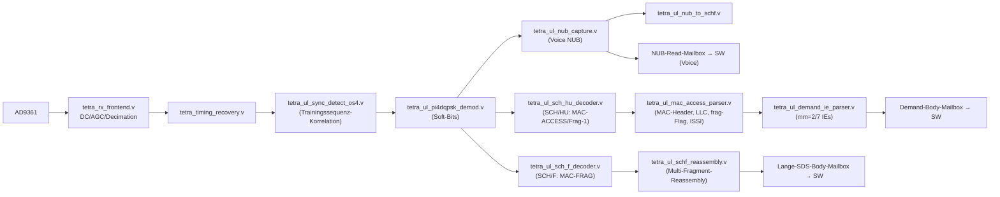
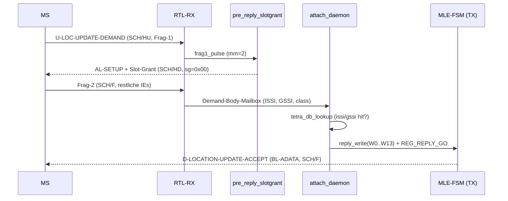
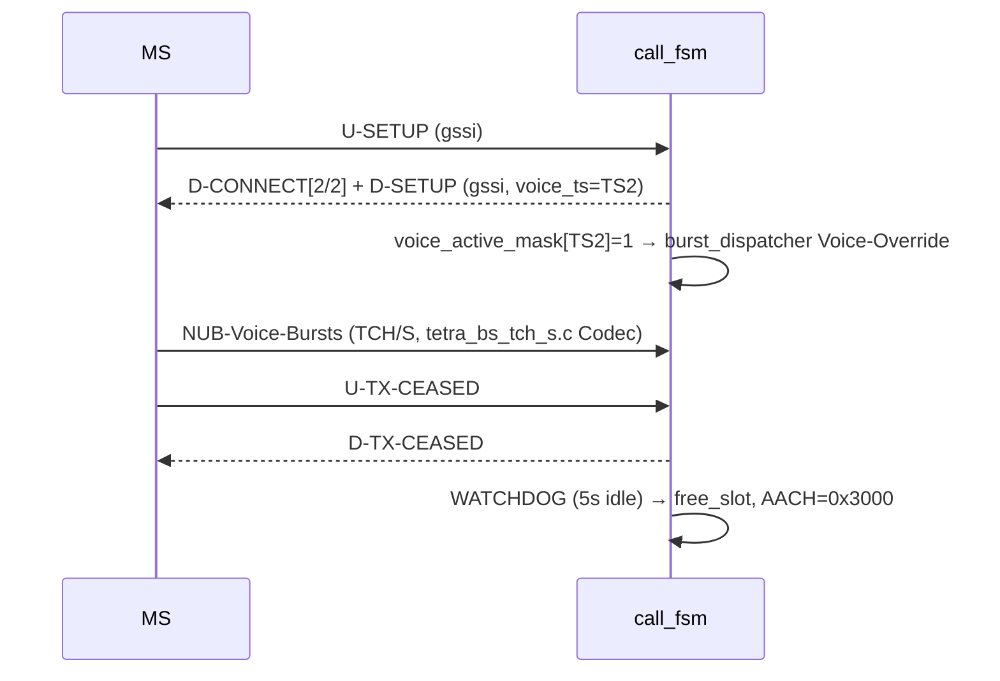
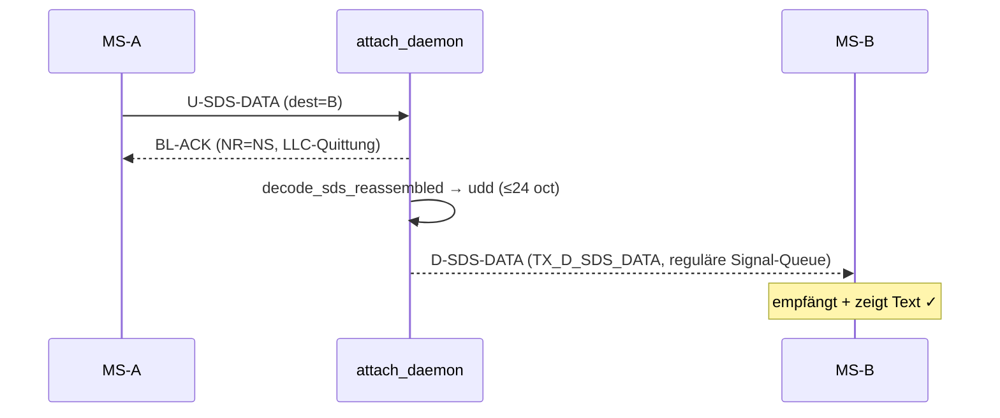
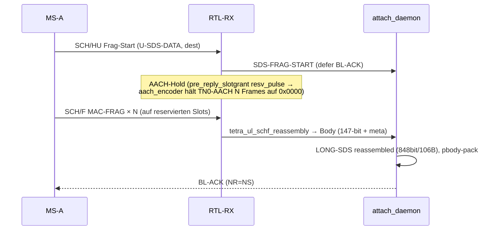
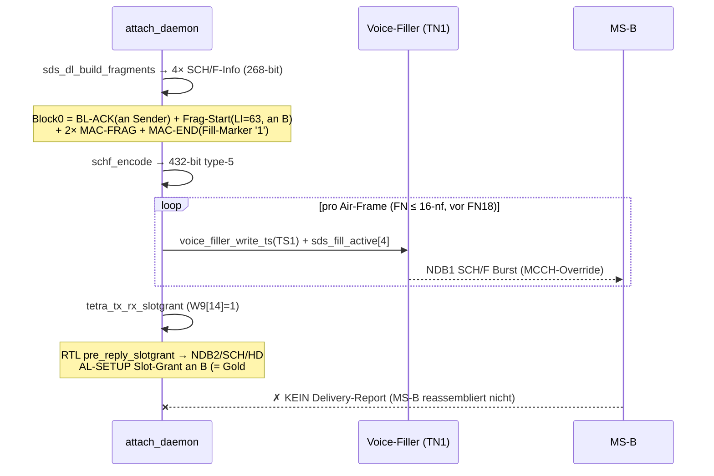

# tetra-zynq-phy — Code-Analyse & Flow-Dokumentation

> Vollständige Architektur-/Datenfluss-Analyse der TETRA-Basisstation auf
> Zynq-7020 + AD9361. RTL (`rtl/`) = PHY + zeitkritische MAC/LLC; SW (`sw/`,
> ARM/Linux) = Zell-Config, Registrierung, Call-FSM, SDS, Relay.
> Mermaid-Diagramme rendern in GitHub/VS-Code; ASCII für Terminal.
> Stand 2026-06-16.

---

## 1. System-Architektur



**HW/SW-Schnitt:**
- **PHY + Burst-Timing + zeitkritische Encode/Decode** → RTL (deterministische
  TDMA-Frame-Grenzen, kein Linux-Jitter).
- **Protokoll-Logik** (Wer ist registriert? Call-State? SDS-Routing?) → SW, pollt
  RX-Mailboxen + schreibt TX-Mailboxen via AXI-Lite (Basis `0x43C00000`).
- **AD9361** via AXI-Stream-Adapter (`tetra_ad9361_axis_adapter.v`).

---

## 2. TDMA-Rahmenstruktur (ETSI EN 300 392-2 §9)

```
Hyperframe = 60 Multiframes │ Multiframe = 18 Frames │ Frame = 4 Slots(TN) │ Slot = 510 Bit (255 Symbole)
                                              ▲
                                       FN18 = Kontrollframe (BNCH/BSCH-Broadcast)
TN1 = MCCH (Main Control Channel, Idle-MS lauschen)   TN2-4 = SYSINFO/Traffic
```

- **Burst-Typen:** SB (Sync, BSCH+BNCH), **NDB1** (Normal DL, voller Slot = SCH/F
  268 Info-Bit, BKN1+BKN2 kombiniert, a=103), **NDB2** (Halbslot, 2× SCH/HD
  je 124 Info-Bit, a=101), Voice (TCH).
- **RTL-Zeitbasis:** `tetra_tdma_timebase.v` (fn_sys 0-basiert 0..17),
  `tx_frame_cnt_sys` (1..18, free-running) → REG_TX_TDMA (0x38);
  **REG_TX_TDMA_STATE (0x144)** = netz-synchroner Air-FN (`tx_tdma_state_fn`).
- **AACH (Access Assignment, 14-bit, RM(30,14)):** `0x0009` signalling-active,
  `0x0249` idle MCCH, `0x3000` traffic-idle (`tetra_pdu_class.vh`).

---

## 3. TX-Kette (DL: BS → MS)



**Kernpunkt (für SDS relevant):** Der `burst_dispatcher` wählt pro TN entweder den
vom Scheduler/Queue gelieferten Burst **oder** überschreibt ihn mit dem
**Voice-Filler** (`voice_active_mask | sds_fill_active`, nur `tx_fn_sys ≤ 16`,
d.h. **nicht** auf FN18). Voice-Bursts UND die lange-SDS-Frag-Kette laufen über
diesen Filler-Override; reguläre Signalisierung (kurze SDS, Attach, Call) über die
**DL-Signal-Queue + Scheduler**.

**Encode-Pipeline (SCH/F 268→432):**
```
268 Info + 4 Tail → RCPC 1/3 (tetra_rcpc_encoder) → 432 → Reed-Muller/Punktierung
→ Interleave (tetra_interleaver) → Scramble (tetra_scrambler, init=MCC/MNC/CC)
→ 432 type-5 Bit → π/4-DQPSK-Symbole
```

---

## 4. RX-Kette (UL: MS → BS) + DL-Eigenempfang



- **Decode:** Soft-Viterbi (`tetra_ul_viterbi_r14[_bram]`, R=1/4) + Depunktur
  (`tetra_depuncture_r23`) + CRC16 (`tetra_crc16`).
- **SW liest** über Mailboxen: Demand (mm=2 Attach / mm=7 Group), lange-SDS-Body
  (147-bit + meta-Bündel), Voice-NUB.
- **Slot-Grant-Trigger:** `frag1_pulse` aus dem MAC-ACCESS-Parser → `pre_reply_
  slotgrant` (UL-Sender bekommt SCH/F-Slots für seine Frag-Kette).

---

## 5. Protokoll-Stack & PDU-Katalog

```
PHY (Burst/type-5)
 └─ MAC  : MAC-RESOURCE | MAC-FRAG/END | MAC-BROADCAST | MAC-ACCESS(UL)
     └─ LLC : BL-ADATA | BL-DATA | BL-UDATA | BL-ACK | AL-SETUP | (+FCS-Varianten)
         └─ MLE-PD(3) : 1=MM, 2=CMCE, 4=SNDCP, 5=MLE
             ├─ MM   : D-LOC-UPDATE-ACCEPT/REJECT, D-ATTACH-DETACH-GRP-ID(-ACK), U-LOC-UPDATE-DEMAND …
             └─ CMCE : D-SETUP/CONNECT/…/SDS-DATA, U-SETUP/CONNECT/SDS-DATA …
```

### 5.1 MAC-Layer-PDUs

```
MAC-RESOURCE (DL, type=00) — tetra_mac_resource_dl_builder.v / decode_dl.py
┌────┬────┬────┬─────┬────┬──────┬────────┬───────────┬──────────────────────────────┐
│type│fill│pog │ enc │ ra │  LI  │addr_typ│  Adresse  │ [pc][sg+elem][ca] │ TM-SDU      │
│ 2  │ 1  │ 1  │  2  │ 1  │  6   │   3    │ SSI 24 /  │  je 1 Flag        │ (LLC-PDU)   │
│=00 │    │    │     │    │      │ =001   │ SSI+UM 30 │  + optionale Elem │             │
└────┴────┴────┴─────┴────┴──────┴────────┴───────────┴──────────────────────────────┘
   LI (length_indication): 1..62 = PDU-Länge in Oktetten | 63 = FRAG-START (Kette folgt)
   slot_granting_element 8-bit: [7:4]=capacity_alloc, mm=2→0x00 (1 Subslot), mm=7→0x30 (3 Slots)

MAC-FRAG / MAC-END (type=01) — Fortsetzung einer fragmentierten TM-SDU
┌────┬─────┬────┬──────────────┐   sub=0 → MAC-FRAG (voller Payload)
│type│ sub │fill│   Payload    │   sub=1 → MAC-END  (letztes Fragment)
│ 2  │  1  │ 1  │  (TM-SDU-    │   fill=1 → Fill-Bits am Ende:
│=01 │     │    │   Fortsetz.) │      ETSI §23.4.3: erstes Fill-Bit='1', Rest '0'
└────┴─────┴────┴──────────────┘      → Empfänger verwirft letztes '1' + folgende '0'

MAC-BROADCAST SYSINFO (type=10, btype=00) — tetra_hal.c
 main_carrier(12) band(4) offset(2) duplex(3) rev(1) num_sec_cch(2) txpwr(3)
 rxlev_min(4) access_param(4) dl_timeout(4) … optional_field_sel(2) + value(20)
   opt 2 = DEFAULT-DEF-FOR-ACCESS (0xF6200) | opt 3 = EXTENDED-SERVICES-BROADCAST (0x40C10)
   (Daemon-Loop alterniert 2↔3 — Gold-konform; nötig damit MS erweiterte Dienste kennt)

MAC-ACCESS (UL, tetra_ul_mac_access_parser.v) — 24-bit ISSI, optional-field, frag-Flag
```

### 5.2 LLC-Layer (4-bit pdu_type, `tetra_pdu_class.vh`)

| Wert | PDU | Folgefelder | Verwendung |
|---|---|---|---|
| 0 | **BL-ADATA** | NR(1)+NS(1) | quittierte Daten (Attach-ACCEPT, GRP-ACK) |
| 1 | **BL-DATA** | NS(1) | sequenzierte Daten (lange DL-SDS) |
| 2 | **BL-UDATA** | — | unquittiert (NWRK-Broadcast) |
| 3 | **BL-ACK** | NR(1) | LLC-Quittung (SDS-Empfang, NR=NS) |
| 4-7 | BL-*+FCS | wie 0-3 + CRC32 | mit Frame-Check |
| 8 | **AL-SETUP** | (Advanced Link) | Slot-Grant-Träger (Pre-Reply) |
| 9 | AL-DATA/FINAL | | Advanced-Link-Daten |

### 5.3 MM-PDUs (MLE-PD=1)

| DL | | UL |
|---|---|---|
| 5 D-LOCATION-UPDATE-ACCEPT | | U-LOCATION-UPDATE-DEMAND (mm=2) |
| 7 D-LOCATION-UPDATE-REJECT | | U-MM-STATUS |
| 10/11 D-ATTACH-DETACH-GRP-ID(-ACK) | | (Group-Attach mm=7/11) |

### 5.4 CMCE-PDUs (MLE-PD=2, pdu_type 5-bit) — `tetra_cmce_body.c` / `_parser.c`

| # | DL (D-) | # | UL (U-) |
|---|---|---|---|
| 0 | D-ALERT | | U-ALERT |
| 1 | D-CALL-PROCEEDING | | |
| 2 | D-CONNECT | | U-CONNECT |
| 3 | D-CONNECT-ACK | | |
| 6 | D-RELEASE | | U-RELEASE |
| 7 | D-SETUP | | U-SETUP |
| 8 | D-STATUS | | U-STATUS |
| 9 | D-TX-CEASED | | U-TX-CEASED |
| 11 | D-TX-GRANTED | | U-TX-DEMAND |
| 15 | **D-SDS-DATA** | | **U-SDS-DATA** |

```
CMCE D-SDS-DATA (#15) — DL-SDS-Zustellung (tetra_cmce_body / tetra_sds_dl_frag.c)
┌──────┬──────┬──────────────┬──────┬───────┬──────────────┬───────┐
│ pdu  │ CPTI │ calling_ssi  │ SDTI │  LI   │     UDD      │ o-bit │
│ 5=15 │  2=1 │      24      │  2=3 │  11   │  LI bit      │   1   │
└──────┴──────┴──────────────┴──────┴───────┴──────────────┴───────┘
   CPTI=1 (SSI) · SDTI=3 (UDD-4/Text) · LI = User-Data-Länge in Bit (z.B. 704=88 oct)
   UDD = SDS-TL-PDU: PID(0x82=Text) + Header + Message-Reference + Text
U-SDS-DATA (UL) zusätzlich: area_selection(4) nach pdu_type; addressiert dest_ssi
```

---

## 6. Schlüssel-Prozedur-Flows

### 6.1 Registrierung / ITSI-Attach (mm=2)



### 6.2 Gruppen-Sprechruf (tetra_call_fsm.c)



### 6.3 Kurze SDS (≤24 oct) — funktioniert end-to-end



### 6.4 Lange SDS UL-Empfang (>24 oct) — GELÖST + air-verifiziert



### 6.5 Lange SDS DL-Zustellung (>24 oct) an MS-B — **OFFEN** (Kern dieser Session)



---

## 7. Lange-SDS-DL: Stand & 5 gold-verifizierte Fixes

Referenz = DAMM-Netz (`wavs/reference/DL_…392987000Hz`, CC=1) liefert an unser
MTP3550 (2633617) erfolgreich eine lange SDS. Meine Zelle (CC=49) repliziert das
**bit-identisch**, aber MS-B reassembliert die Kette nicht.

| # | Fix | Datei | verifiziert |
|---|---|---|---|
| 1 | Format BL-DATA / MAC-END@4 / LI=63 / Block0 BL-ACK+Frag-Start | `tetra_sds_dl_frag.c` | reassembliert bit-identisch |
| 2 | FN18-Pacing über REG_TX_TDMA_STATE(0x144), Start-Fenster | `tetra_attach_daemon.c` | Kette konsekutiv vor FN18 |
| 3 | Slot-Grant NDB2/SCH/HD via W9[14] SW-Trigger | `pre_reply_slotgrant.v`, `reply_mailbox.v`, `zynq_top.v`, `tetra_tx_transport.c` | on-air = Gold #822 |
| 4 | SYSINFO EXTENDED-SERVICES-Toggle (sel 2↔3) | `tetra_hal.c` | BKN2-Reg alterniert |
| 5 | MAC-END Fill-Marker (ETSI §23.4.3) | `tetra_sds_dl_frag.c` | Fill-Removal → volle 757-bit TM-SDU |

**Verbleibende Hypothese:** TX-Pfad — lange SDS über **Voice-Filler-Override** (TN1)
vs. kurze SDS über die **reguläre DL-Signal-Queue/Scheduler**. Bursts dekodieren im
Capture identisch (corr 0.99), aber MS-Bs MCCH-Empfänger verarbeitet Voice-Filler-
Override evtl. nicht wie scheduler-getriebene Fragmente. → Siehe Memory
`project_long_sds_dl_fragmentation_relay`. Offene Entscheidung: Isolationstest
(kurze SDS über Voice-Filler) vs. Umbau (Frag-Kette über DL-Signal-Queue).

---

## 8. SW-Modul-Referenz (Kurz)

| Datei | Rolle |
|---|---|
| `tetra_hal.c/.h` | Zell-Config, SYSINFO/BNCH-Bau, AXI-HAL, SYSINFO-Daemon-Loop |
| `tetra_attach_daemon.c` | Haupt-Daemon: Demand-Walker, SDS-RX/Relay, DL-Frag-Delivery, Voice-Pipe-Service |
| `tetra_tx_transport.c/.h` | Reply-Mailbox-Staging (stage_raw_mm, W0..W13), CMCE-Submit, rx_slotgrant |
| `tetra_cmce_body.c` / `_parser.c` | CMCE-PDU-Bau / -Parse (D-*/U-*) |
| `tetra_mm_demand_parser.c` | UL-mm=2/7-Demand-IE-Parse |
| `tetra_call_fsm.c/.h` | Sprechruf-State-Machine (U-SETUP→D-CONNECT→Voice→Release) |
| `tetra_sds_dl_frag.c/.h` | DL-MAC-Fragmentierung langer SDS (+ Slot-Grant-PDU-Bau) |
| `tetra_voice_filler.c` / `tetra_voice_pipe.c` | Voice-Burst-Filler / Voice-Pipeline |
| `tetra_tch_s_codec.c` / `bs_tch_s.c` / `etsi_tch_s.c` | TETRA-Sprach-Codec (TCH/S) |
| `tetra_channel_codec.c` | SCH/F-Encode (SW-seitig) |
| `tetra_db.c/.h` | Teilnehmer-DB (ISSI/GSSI) |
| `tetra_ts_map.h` | TS↔Air-Slot-Timing-Konvertierung |

## 9. Wichtige AXI-Register (Basis 0x43C00000)

| Offset | Register | Zweck |
|---|---|---|
| 0x38 | REG_TX_TDMA | tx_mf/frame/slot (free-running) |
| 0x144 | REG_TX_TDMA_STATE | **netz-synchroner Air-FN** [6:2] (für FN18-Pacing) |
| 0x1AC | REG_DB_POLICY | USE_SW + DB-Policy (=0x3) |
| 0x220-0x230 | REG_REPLY_* | Reply-Mailbox (INDEX/DATA/GO/STATUS); W9[14]=slot-grant-req |
| 0x1EC | REG_VOICE_ACTIVE_MASK | [3:0]=voice TN, [7:4]→sds_fill_active CDC |
| 0x60-0x7C | REG_SB_BKN2_* | SYSINFO BKN2 (alternierendes Optional-Field) |
| 0xF8-0x12C | REG_BNCH_BLK1/2_* | BNCH-Broadcast-Blöcke |
